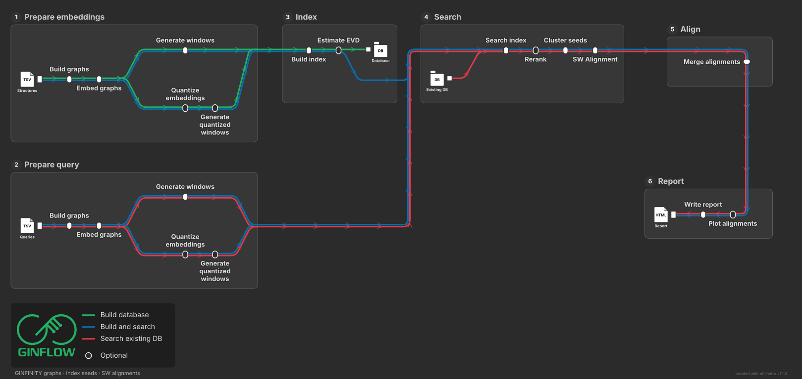

# How GINflow works

GINflow is a BLAST-style search engine for **RNA secondary structure**.
It does not align sequences with a nucleotide substitution matrix. It
embeds each nucleotide in a graph built from the sequence and the
dot-bracket structure, finds short similar windows, extends those hits
into HSPs, and scores the resulting alignments with Karlin–Altschul
E-values.

The closest BLAST analog is:

| BLAST | GINflow |
|---|---|
| Word / k-mer hits | Sliding windows of residue embeddings |
| Ungapped HSP extension | Diagonal clustering of seeds |
| Gapped extension | GINFINITY-SW on a padded crop |
| Combined HSPs per pair | `MERGE_ALIGNMENTS` |
| Database E-value | $E = K m N \exp(-\lambda S_{\mathrm{total}})$ |

  

Open circles on the map are optional (quantize, exact rerank, plots).
Index backends have their own map in [Window indexes](indexes.md).

## Run modes

`main.nf` infers the mode from flags. Do not pass `--input`, `--query`,
and `--database` together.

| Flags | What runs |
|---|---|
| `--input` | Embed structures, build a reusable window database, fit EVD |
| `--query` + `--database` | Embed queries, search an existing `index/` directory |
| `--input` + `--query` | Build, search, and publish the database in one run |

If `--input` and `--query` are the same file, embeddings are computed
once and reused for search.

The entry workflow (`main.nf`) validates flags, then calls the named
workflow `GINFLOW` in `workflows/ginflow.nf`. Publishing happens in
`main.nf` via Nextflow workflow outputs (not `publishDir`).

## Stage 1 — Graphs

`PREPARE_WINDOWS` (`workflows/prepare_windows.nf`) splits the structures
table into shards of `--shard_size` **input rows** (default 50). A row
with several `start`/`end` windows expands to several graphs *inside*
that shard.

`BUILD_RNA_GRAPHS` runs `ginfinity build-graphs`. Each nucleotide is a
node. Edges come from the backbone, canonical pairs in the dot-bracket
string, and skip-2 contacts. Optional `start`/`end` columns build a
**sliced graph**: the published subject is the core interval, but
crossing-pair partners outside the core stay in the graph so message
passing can use them (`--keep_paired_neighbours`, `--context_hops 4`).
See [Sliced graphs](usage.md#sliced-graphs).

Artifacts: `graphs_shards/<shard>/*.safetensors` and `*.json` when
`--save_graphs` is enabled. Graphs are still produced internally when
downstream stages need them.

## Stage 2 — Embeddings

`EMBED_RNA_GRAPHS` runs `ginfinity embed-graphs`. Each nucleotide becomes
a 128-dimensional vector. Storage is float16.

For a sliced subject the embedding has shape `(end - start, 128)` —
core nucleotides only. Context nodes are used during message passing
and then dropped.

Artifacts: `embeddings_shards/<shard>/*.npz` and `*.manifest.json` when
`--save_embeddings` is enabled. Embeddings are still produced
internally when downstream stages need them.

## Stage 3 — Windows

`GENERATE_WINDOWS` (`bin/slice_windows.py`) cuts each embedding into
sliding windows:

- default `--window_size 11`, `--window_stride 1`
- each window concatenates 11 × 128 = **1408** dimensions
- each window is L2-normalized, so an inner product is cosine similarity

A molecule shorter than `window_size` contributes no windows.

These windows are **not** the optional `start`/`end` columns. Slices
change the graph GINFINITY builds; windows are a search seed over an
already-embedded subject.

Artifacts: `windows_shards/<shard>/*.windows.npz` and
`*.windows.manifest.json` when `--save_windows` is enabled. Windows are
still produced internally when downstream stages need them.

## Stage 4 — Optional node compression

`--quantize none|sq|pq|opq` compresses each **128-d node** before index
windows are formed. Library product quantizers that treat a 1408-d
window as one vector (`IndexIVFPQ`, cuVS IVF-PQ) are not offered: they
split the window in the wrong places.

| Mode | Per node | Distance |
|---|---|---|
| `none` | float16 / float32 | Inner product or L2 |
| `sq` | int8 affine | Standard IP/L2 after dequant |
| `pq` | `M` subcodes | SDC to **build** the graph, ADC to **search** |
| `opq` | Same codes after a 128×128 rotation | Same as PQ; queries are rotated first |

`FIT_NODE_QUANTIZER` trains on database embeddings.
`APPLY_NODE_QUANTIZER` reuses that codebook on queries (SQ) so query
and database live in the same code space. PQ/OPQ search is asymmetric:
queries stay in original node space and score database codes with ADC.

Recommended compact layout: `--quantize opq --pq_m 16 --pq_nbits 4`.

Quantized window shards are an internal handoff to the index builder and are
not published by default. Use `--save_quantized_windows` when you need that
intermediate representation for inspection or debugging.

## Stage 5 — Index

One of four libraries builds a reusable window database under `index/`:

| `--index` | Quantize | Role |
|---|---|---|
| `faiss` (default) | `none`, `sq` | CPU FAISS; GPU Flat with `--faiss_device gpu` |
| `cagra` | `none`, `sq` | Stock cuVS CAGRA (GPU graph) |
| `cagra` | `pq`, `opq` | Custom PQ-CAGRA (GPU build, GPU or CPU ADC search) |
| `ivf` | `none`, `sq` | cuVS IVF-Flat (GPU) |
| `hnswlib` | `pq`, `opq` | CPU custom-distance HNSW; use only when **build** has no GPU |

Default is exact cosine: `--index faiss --faiss_index flatip`.

The database always also packs:

- `embeddings.npz` — original residue vectors for SW, rerank, and plots
- `records.tsv` — sequence and (pair-closed) structure per subject
- `windows.tsv` — `faiss_id`, `transcript_id`, `start`, `end`
- `meta.json` — window geometry, model fingerprint, index settings
- `evd.json` — Karlin–Altschul λ, K, database residue count

Later `--query --database <outdir>/index` reads that directory.
`--index` must match `meta.json` if you set it explicitly.

Full matrix: [Window indexes](indexes.md).

## Stage 6 — Search and rerank

Query shards go through the same graph → embed → window path
(`PREPARE_QUERY`). `--search_shard_size` sets query rows per search
task (default: `--shard_size`).

The index returns up to `--candidate_k` neighbours per query window
(default 200). `RERANK_CANDIDATES` then scores those labels with the
**original** L2-normalized windows and keeps `--seed_k` seeds (default
50) above `--seed_min_similarity` (default 0.8). Exact rerank is on by
default and is skipped for already-exact FlatIP / FlatL2.

Seeds are concatenated into `seeds/seeds.tsv`:

`query_id`, `query_start`, `query_end`, `target_id`, `target_start`,
`target_end`, `score`, `rank`.

Raise `--candidate_k` and `--seed_k` as the database grows (for example
`--candidate_k 1000` around 1 million windows, `5000` around 4 million).

## Stage 7 — Clustering

`CLUSTER_SEEDS` groups nearby seeds into HSP-like boxes, independently
per query–target pair. A cluster starts at the highest-scoring unused
seed and grows by the best remaining seed that:

- sits within `--cluster_span` (default 80 nt) of the current box on
  both query and target
- stays inside `--cluster_diagonal_tolerance` (12) of the current
  diagonal range
- does not push diagonal breadth past `--cluster_max_diagonal_span` (96)

Seeds worse than `--cluster_max_seed_rank` (10) are ignored. Clusters
with fewer than `--cluster_min_seeds` (2) seeds are dropped.

Each cluster is a candidate local alignment, not yet a gapped alignment.

## Stage 8 — Smith–Waterman

`ALIGN_CLUSTERS` loads residue embeddings once and runs
[GINFINITY-SW](https://github.com/nicoaira/GINFINITY-SW) on a padded
crop of each cluster (`--align_pad`, default 32 nt), not the full
molecules. Independent crops use `--align_cpus` threads (default 8).
Scoring is embedding cosine with the transform and affine-gap parameters
configured in `nextflow.config` (`align_mu`, `align_sigma`,
`align_gamma`, `align_score_min`, `align_score_max`, `align_gap_open`,
`align_gap_extend`, and `align_score_offset`). The process emits **one
row per cluster**. When plotting is enabled, `MERGE_ALIGNMENTS` also emits
one raw-HSP table per query for the plotting processes.

`MERGE_ALIGNMENTS` is the pair-level boundary: every HSP for the same
query and target becomes one BLAST-style result with `total_score`
(sum of disjoint HSP scores), `max_score`, and a database E-value
computed from the aggregate.

Details: [Clustering and alignment](clustering-and-alignment.md).

## Stage 9 — E-values

`ESTIMATE_EVD` runs at database-build time. It samples reverse-sequence
query crops against random targets, scores them with the same
multi-HSP SW, and fits Karlin–Altschul λ and K with a length-aware
Gumbel MLE. The null **preserves local embedding correlation** and
**destroys homology**.

$$
E = K\, m\, N\, \exp(-\lambda S_{\mathrm{total}})
$$

- $m$ — query length
- $N$ — searchable database residues
- $S_{\mathrm{total}}$ — sum of disjoint HSP scores for the pair

`evalue_pair` uses the target length instead of $N$. Bit scores use
$(\lambda S - \ln K) / \ln 2$.

Details: [E-values](statistics.md).

## Stage 10 — Plots and report

Optional per-query draw tasks:

- `--plot_backend rnartistcore|r4rna|both` — 2D structure / alignment
  arc plots
- `--plot_sw` — crop cosine matrix and SW score matrix with traceback

`WRITE_REPORT` always writes a standalone `report.html` on query runs:
ranked hits, E-values, aligned spans, and inlined plots.

Details: [Plotting and report](plotting.md) and [Output](output.md).

## Code map

| Layer | Path |
|---|---|
| Entry workflow, validation, publish | `main.nf` |
| Named analysis workflow | `workflows/ginflow.nf` |
| Graph / embed / window / quantize | `workflows/prepare_windows.nf` |
| Nextflow processes | `modules/<name>/main.nf` |
| Python / C++ tools | `bin/` |
| Parameters | `nextflow.config`, `nextflow_schema.json` |
| SW scoring | Alignment parameters in `nextflow.config` |
| PQ-CAGRA native code | `vendor/cagra-pq-adc/` |
| hnswlib (PQ CPU path) | `vendor/hnswlib-0.8.0/` |
